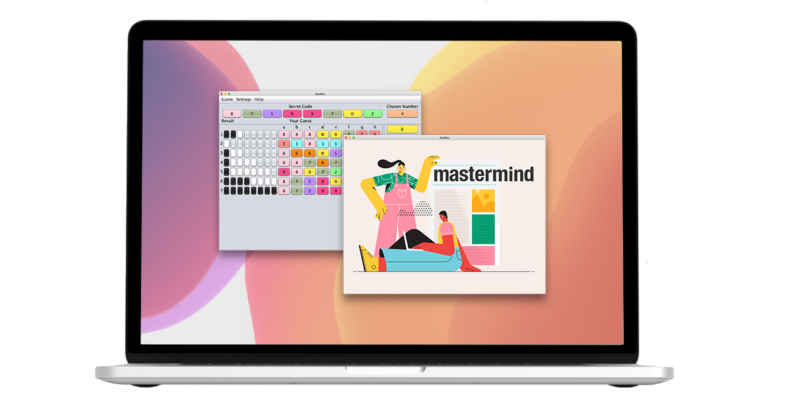
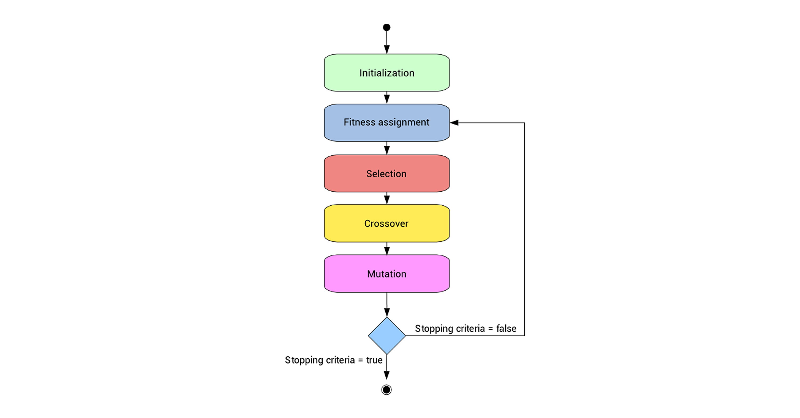

# Mastermind    
Mastermind Game implementation in Java Swing including an AI, which can be played by a user "against" the computer and vice versa. **It utilizes Google Cloud Text-to-Speech API and/or prerecorded audio files which allow blind or visually impaired users to navigate and understand the current state of the game.** This is a game where a player tries to guess the number combination. Each guess results in feedback, narrowing down the possibilities of the code. The computer provides feedback whether the player had guess a number correctly, or/and a number and its position correctly. A player must guess the right number combinations within 10 attempts to win the game.
Additionally, the player can choose the option to be the Codemaker and watch the AI breaking the code.  

* [**Demo Video**](https://youtu.be/veBUPgUaIrw)  
* [**UML Diagram**](https://github.com/mariiaromaniuk/Mastermind/blob/master/uml%20diagram/UML%20Diagram.pdf) 
* [**User Manual**](https://github.com/mariiaromaniuk/Mastermind/blob/master/src/gui/how-to.pdf)

## User Interface  
  


  
## Implementation  
[**MVC Design Pattern**](https://github.com/mariiaromaniuk/Mastermind/blob/master/uml%20diagram/UML%20Diagram.pdf)  
[**Model**](https://github.com/mariiaromaniuk/Mastermind/tree/master/src/common) - common classes to manage Mastermind game data and interact with the game engine. The central component of the pattern. It is the application's dynamic data structure, independent of the user interface. It directly manages the data, logic and rules of the application.  
  * Color - represents the numbers and colors used in the game engine (bonded together in enum type).
  * Row - represents a single Row with numbers set for the guess.
  * Debug - used for debugging, i.e. with a function for debug-output.
  
[**View**](https://github.com/mariiaromaniuk/Mastermind/tree/master/src/gui) - contains all GUI elements and functions that a user needs to interact with the game engine. Various controls (buttons, sliders, menu, etc.) are implemented so that the user can interact and navigate through the game. The controls also send information to the backend to process API web calls, evaluate user input, and determine results. 
  * MainWindow - contains all GUI elements and functions that a user needs to interact with the Mastermind game engine (package game). Changes in the GUI elements don't affect the game engine.
  * how-to - user guide in PDF format with a detailed description of the roles and all the elements of the game. Automatically opens if the user selects *Help → How To Play* at the game control menu panel.
  
[**Controller**](https://github.com/mariiaromaniuk/Mastermind/tree/master/src/game) - a Mastermind game engine. It is self-contained so that any UI (GUI, console, etc.) only have to use the ControlInterface of the game package. This design makes the GUI and engine nearly independent from each other. Logical changes in the Mastermind engine don't affect the GUI.  
* **Game package**
   * ControlInterface - the main interface to control the game flow. This class provides all the functions for a game. This is the only public class in the game package. This design is used to provide a single interface for a frontend (or an AI) which guarantees a correct and safe execution.
   * Game - game-engine class, controls the game flow.
   * GameField - the actual game field. This includes the guess rows and the result rows. The active row number is stored here also.
   * HTTPUtils - low-level class-util that handles all http work for obtaining results without third-party libs.
   * SecretCode - this class represents the secret code the player has to guess.
   * Settings - contains all settings of the game.  
* **AI package**
   * SolvingAlgorithm - this interface describes how a solving algorithm has to be implemented. It has to be able to generate and make a valid guess based on previous guesses interacting with the ControlInterface.
   * Bruteforce - a solving algorithm using the Brute-force search technique.
   * Clues - checks if the guess is valid or makes no sense in the context of previous guesses and results.
   * GeneticSolver - a genetic solving algorithm.
   * RandomGuesses - a "solving algorithm" that makes random guesses.

[**Random Number API Integration**](https://github.com/mariiaromaniuk/Mastermind/blob/master/src/game/SecretCode.java)  
The number combination is generated from https://www.random.org/clients/http/api/  API. Random.org is a true random number generator that generates randomness from atmospheric noise. The call is made with the url I created based on the needed parameters: num, min, max, col, base, format, rnd. The strings I got back from the API were written in one column, therefore I added them to an array.  
```java
// Parameters for query, num = 4 and max = 7 assigned by default 
// in Settings, but can be changed according to player preferences 
    int min = 0, col = 1, base = 10;
    String format = "plain";
    String rnd = "new";

    public int[] generate(int num, int max) throws IOException {
     String query = "https://www.random.org/integers/"
                + "?num=" + num
                + "&min=" + min
                + "&max=" + max
                + "&col=" + col
                + "&base=" + base
                + "&format=" + format
                + "&rnd=" + rnd;

        ArrayList<String> strings = HTTPUtils.get(query);
        int[] numbers = new int[num];

        for (int i = 0; i < strings.size(); i++) {
            numbers[i] = Integer.parseInt(strings.get(i));
        }
        return numbers;
    }
```
[**Color Enumeration**](https://github.com/mariiaromaniuk/Mastermind/blob/master/src/common/Color.java)  
Represents the numbers used in the game engine (secret code) and unique colors assigned to each of them bonded together in enumeration type. Randomly generated secret code will be converted from integer primitive data type into an enumerated object that contains two parameters: the integer value and the unique color value assigned to it. The color value is the RGB value representing the color in the default SRGB ColorModel. Bits 24-31 are alpha, 16-23 are red, 8-15 are green, 0-7 are blue. These values are equal to the java.awt.Color.getRGB().

## Extensions Implemented
* Simple AI was added: a player can choose the option to be the codemaker, set the secret code and watch the AI breaking the code.  
* Google Cloud Text-to-Speech Java API and/or prerecorded audio files to help explain the current game state to players with vision loss.  
* Configurable "difficulty levels" where added to adjust:
  * the number of digits in the secret code (1-8), 
  * the range of numbers that are used to generate the code (1-10), 
  * the number of attempts (1-10), 
  * use of duplicate numbers (allowed / not allowed).  
* Keeping track of scores and a leaderboard (handles multiple user sessions and store the results in a database).
* Timer countdown: 3 minutes allowed for one game, when time is up game is terminated, but a player can stop the timer if he/she doesn't want to time the game. A player is prevented from accessing the input form after guessing the correct combination or exceeding the allowed number of tries.
* Validation of a player's guess: before checking the result of the guess a player can ask AI to validate it (was it good or bad) and adjust the guess according to the validation.  
* "Two Players" mode: one player sets up the secret code, another takes the role of codebreaker.
* Hints: a player has an option to use AI to set the row for him/her and the option to set the last guess.  
* Option to generate a secret code locally in case if internet connection is not available. 
* Numbers represented as colored pegs with numbers titled on them for convenience.
* A player can use a keyboard instead of GUI buttons to control the game.   
* The timer countdown is agjusted depending on the game difficulty level.  
* Option to save the game progress to the file or open saved game.
* Sound effects, detailed user manual, and UML diagrams.

## AI Implementation

[**Genetic Algorithm**](https://github.com/mariiaromaniuk/Mastermind/blob/master/src/ai/GeneticSolver.java)  
The algorithm itself is pretty straightforward, but the concept is exciting. Inspired by the paper "Efficient solutions for Mastermind using genetic algorithms" by Lotte Berghman, Dries Goossens, Roel Leus. This algorithm evolves the population by comparing every next guess with the previous one by using the following techniques:  
* _**Mutation**._ Replaces the digit of one randomly chosen position by a random another digit.
* _**Permutation**._ The colors of two random positions are switched
* _**Inversion**._ Two positions are randomly picked, and the sequence of colors between these positions is inverted.
* _**One-point crossover**._ A single crossover point on both parents' organism strings is selected. All data beyond that point in either organism string is swapped between the two parent organisms. The resulting organisms are the children. 
* _**Two-point crossover**._ Two points are selected on the parent organism strings. Everything between the two points is swapped between the parent organisms, rendering two-child organisms. A code c is eligible or feasible if it results in the same values for Xk and Yk for all guesses k that have been played up till that stage if c was the secret code. X is the number of exact matches. Y is the number of guesses which are the right color but in the wrong position.  
   

**How genetic algorithm can play this?**  
When we are using genetic algorithms we have the population of individuals. Each individual represents particular solution of our problem. We also have the fitness function, that grades the individuals solutions. If individual have high fitness there is higher probability, that he will pass on his genes to next generation.  
Each number correspond to one color. We get the information about the numbers of correct colors only when we propose the solution, and we can do that 10 times before game ends. We need to find a way of grading individuals based on the information we got from previous rounds.  

We have a list of our previous n trials, with the number of colors on correct places (ccp) and the number on with correct colors but on wrong place (cwp). So if one of solutions will have the same two numbers as the correct solution, there is very high probability it will be the correct solution (and it goes up with the number of rounds). We can use this intuition to grade our individual from population, before we choose one as our guess. Fist we can calculate the number of correct colors (scp) and correct color on wrong place (swp) for given sequence compared to the sequence from i-th round. Using this we can calculate fitness as: **fitness = - (sum 2|ccp[i] - scp[i]| + |cwp[i] - swp[i]|)**  

In this equation we sum over the sequences from previous rounds. Number of colors on the correct place is more important, therefore it is multiplied by 2. Minus is changing minimalisation into maximisation - the lower the difference between proposed sequence and sequence we want to find the better.  

[**Brute-force Search Algorithm**](https://github.com/mariiaromaniuk/Mastermind/blob/master/src/ai/Bruteforce.java)   
Also known as "generate and test" is a very general problem-solving technique that consists of systematically enumerating all possible candidates for the solution and checking whether each candidate satisfies the problem's statement. It generates a guess by "incrementing" the previous guess. If no previous guess available generate "lowest" possible guess. Every color is given a value that makes it possible to generate a "lowest" guess and to "increment" a guess.  

**Note:** AI can take up to several minutes, especially if you have set a high width, many colors or when you run the game on a slow computer. This is not a bug, just a side effect of the complex algorithm the AI is using. While the AI is guessing, the GUI is locked. Please stand by until the AI broke the code or the maximum number of tries is reached.  

## Further Development     
* Utilize Google Cloud Text-to-Speech API to explain the current game state to blind players (in progress).  
* Speed test for AI algorithms.

## How To Run
* Download the Mastermind project folder from this Github repository.
* Run any Java IDE (tested on IntelliJ IDEA 2019.1.3).
* Select  *File → New → Project from Existing Sources.* 
* Select _**Mastermind**_ folder in the dialog window and press Open.  
* Module dependency: *File → Project Structure → Modules → Dependencies → Add → JARs or directories → sqlite-jdbc-3.30.1.jar → Apply → Ok.*  
* Open main runner class _**MainWindow**_ (*Mastermind → src → gui → MainWindow*).
* Run the program from there.
 
 
## Technologies Used
* Java 1.8, HTML
* Swing GUI Library: JFC API for Java
* iMovie, Adobe Creative Cloud
* IntelliJ IDEA 
