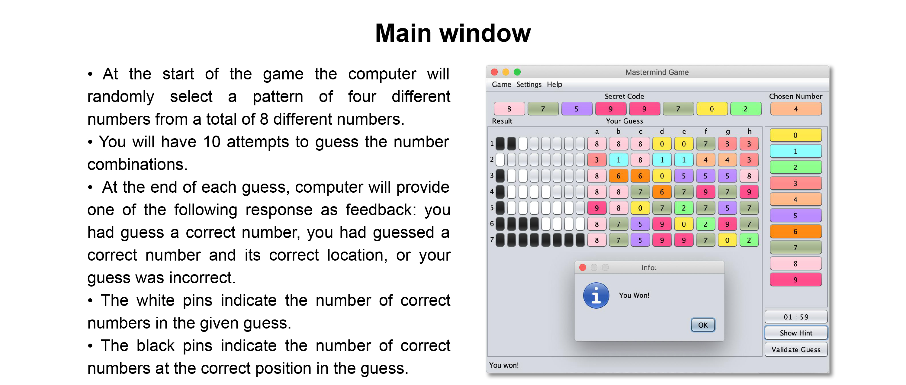
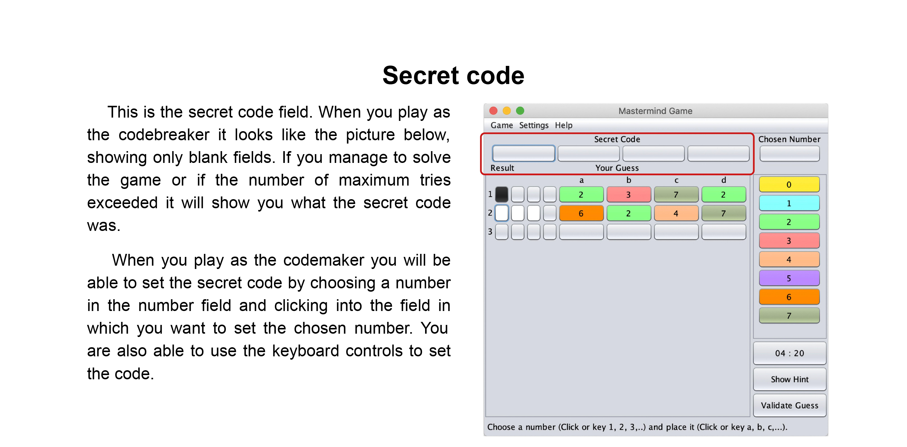
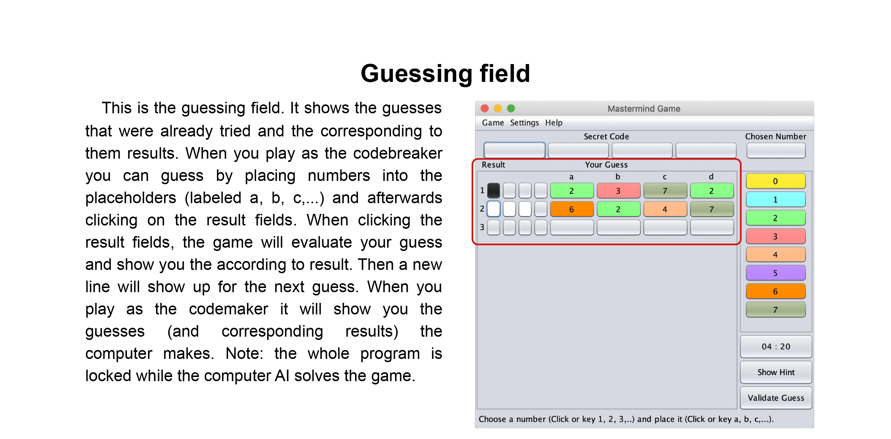
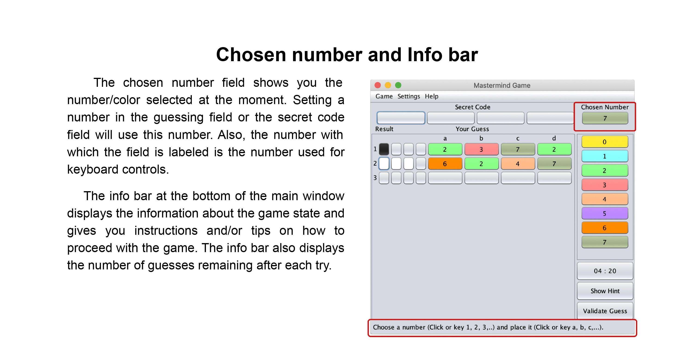
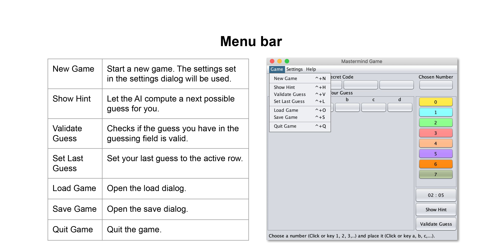
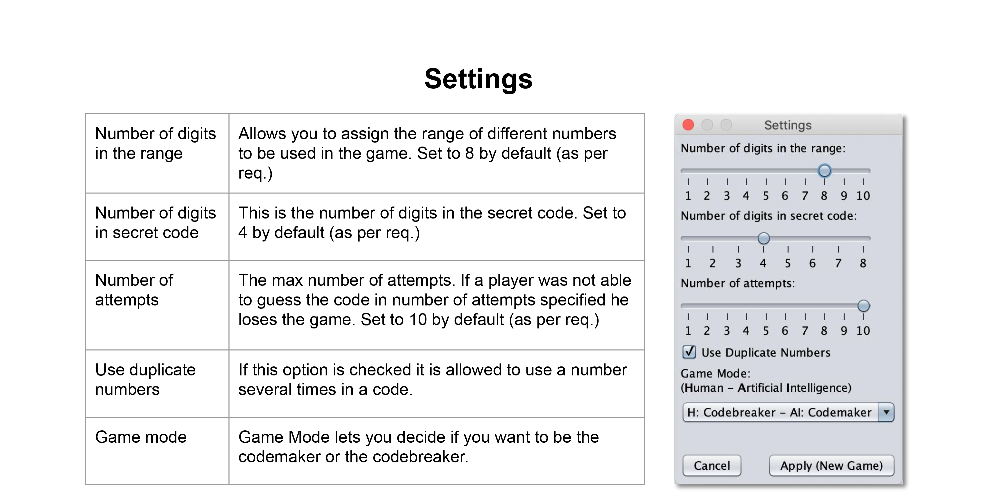
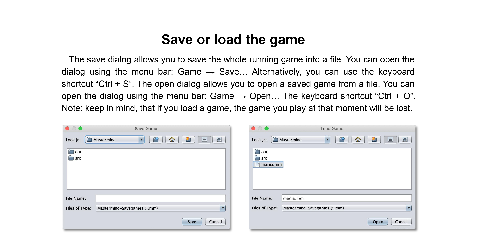
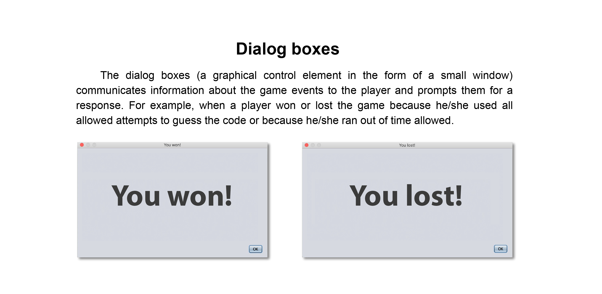

# Decoder1
# InMastermind  
[Watch InMastermind Demo Here](https://youtu.be/veBUPgUaIrw)  
Mastermind Game implementation in Java Swing including an AI, which can be played by a user "against" the computer and vice versa. This is a game where a player tries to guess the number combination. Each guess results in feedback, narrowing down the possibilities of the code. The computer provides feedback whether the player had guess a number correctly, or/and a number and its position correctly. A player must guess the right number combinations within 10 attempts to win the game.
Additionally, the player can choose the option to be the Codemaker and watch the AI breaking the code.  

## User Interface  










  
## Implementation
The number combination is generated from https://www.random.org/clients/http/api/  API. Random.org is a true random number generator that generates randomness from atmospheric noise. 
  
```java
// Parameters for query, num = 4 and max = 7 assigned by default 
// in Settings, but can be changed according to player preferences 
    int min = 0, col = 1, base = 10;
    String format = "plain";
    String rnd = "new";

    public int[] generate(int num, int max) throws IOException {
     String query = "https://www.random.org/integers/"
                + "?num=" + num
                + "&min=" + min
                + "&max=" + max
                + "&col=" + col
                + "&base=" + base
                + "&format=" + format
                + "&rnd=" + rnd;

        ArrayList<String> strings = HTTPUtils.get(query);
        int[] numbers = new int[num];

        for (int i = 0; i < strings.size(); i++) {
            numbers[i] = Integer.parseInt(strings.get(i));
        }
        return numbers;
    }
```


## Additional Features Implemented
* Simple AI was added - a player can choose the option to be the codemaker, set the secret code and watch the AI breaking the code.  
* Configurable "difficulty levels" where added to adjust:
  * the number of digits in the secret code (1 - 8), 
  * the range of numbers that are used to generate the code (1 - 10), 
  * the number of attempts (1 - 10), 
  * use of duplicate numbers (allowed / not allowed).
* Timer countdown: 3 minutes allowed for one game, when time is up game is terminated, but a player can stop the timer if he/she doesn't want to time the game.
* Validation of a player's guess: before checking the result of the guess a player can ask AI to validate it (was it good or bad) and adjust the guess according to the validation.
* Hints: a player has an option to use AI to set the row for him/her and the option to set the last guess.
* Numbers represented as colored pegs with numbers titled on them for convenience.
* Option to save the game progress to the file or open saved game.
* A player can use a keyboard instead of GUI buttons to control the game.
* Sound effects, detailed user manual, and UML diagrams.

## AI Implementation
AI generates a valid guess based on previous guesses. Following algorithms where implemented:

[**Genetic Algorithm**](https://en.wikipedia.org/wiki/Genetic_algorithm)  
The algorithm itself is pretty straightforward, but the concept is exciting. Inspired by the paper "Efficient solutions for Mastermind using genetic algorithms" by Lotte Berghman, Dries Goossens, Roel Leus. This algorithm evolves the population by comparing every next guess with the previous one by using the following techniques:  
* _**Mutation**._ Replaces the digit of one randomly chosen position by a random other digit.
* _**Permutation**._ The colors of two random positions are switched
* _**Inversion**._ Two positions are randomly picked, and the sequence of colors between these positions is inverted.
* _**One-point crossover**._ A single crossover point on both parents' organism strings is selected. All data beyond that point in either organism string is swapped between the two parent organisms. The resulting organisms are the children. 
* _**Two-point crossover**._ Two points are selected on the parent organism strings. Everything between the two points is swapped between the parent organisms, rendering two-child organisms. A code c is eligible or feasible if it results in the same values for Xk and Yk for all guesses k that have been played up till that stage if c was the secret code. X is the number of exact matches. Y is the number of guesses which are the right color but in the wrong position.


[**Brute-force Search Algorithm**](https://en.wikipedia.org/wiki/Brute-force_search)   
Also known as "generate and test" is a very general problem-solving technique that consists of systematically enumerating all possible candidates for the solution and checking whether each candidate satisfies the problem's statement. It generates a guess by "incrementing" the previous guess. If no previous guess available generate "lowest" possible guess. Every color is given a value that makes it possible to generate a "lowest" guess and to "increment" a guess.  

**Note:** AI can take up to several minutes, especially if you have set a high width, many colors or when you run the game on a slow computer. This is not a bug, just a side effect of the complex algorithm the AI is using. While the AI is guessing, the GUI is locked. Please stand by until the AI broke the code or the maximum number of tries is reached.

## Build/Edit Mastermind
* Download the Mastermind project folder from this Github repository
* Run any Java IDE (tested on IntelliJ IDEA 2019.1.3)
* Select  *File → New → Project from Existing Sources* 
* Select _**Mastermind**_ folder in the dialog window and press Open
* Open main runner class _**MainWindow**_ (*Mastermind → src → gui → MainWindow*)
* Run the program from there
 
 
## Technologies Used
* Java 1.8, HTML
* Swing GUI Library: JFC API for Java
* iMovie, Adobe Creative Cloud
* IntelliJ IDEA 
